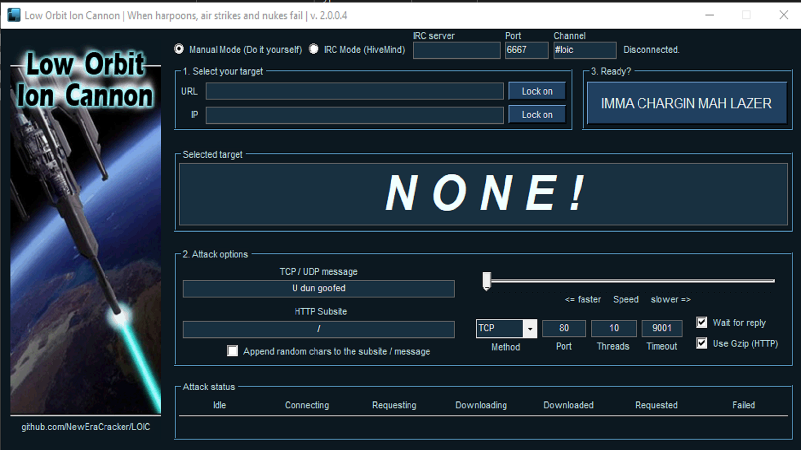

# Low-Orbit-Ion-Cannon-2023

# Distributed Denial of Service (DDoS) Attack

A Distributed Denial of Service (DDoS) attack is a type of denial of service attack in which the incoming traffic flooding the victim so that it cannot respond to legitimate traffic. This project is a simple implementation of a DDoS attack using
Loic Orbit Ion Cannon.

## Getting Started

## Requirements

- Linux

## Usage

To use the project, follow these steps:

- Open the terminal and run the following command:
- `sudo su`
- `apt update`
- `apt install git -y`
- `apt install mono-complete -y`
- `git clone https://github.com/cyberanand1337x/Loic.git`
- `ls`
- `cd Low-Orbit-Ion-Cannon-2023`
- `ls`
- `chmod 777 loic.sh`
- `./loic.sh install`
- `./loic.sh update`
- `./loic.sh run`
